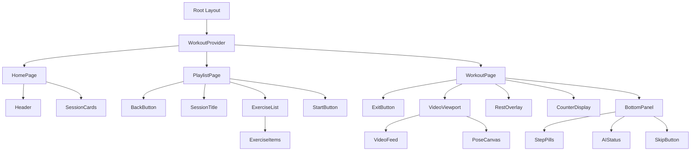
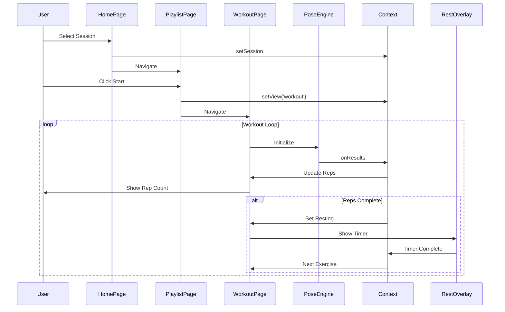
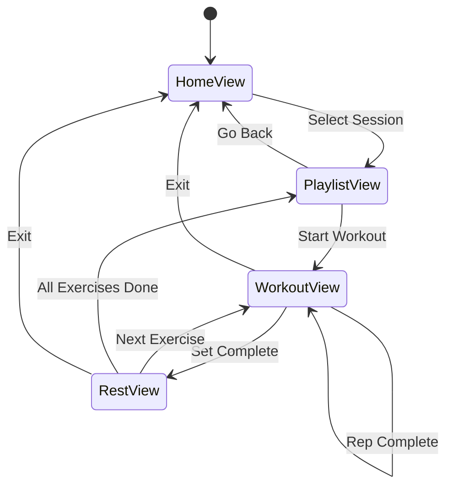

# Spotter.AI - Architecture Diagram

## Component Hierarchy



## Data Flow



## State Management



## File Structure

```
spotter-ai/
├── app/
│   ├── globals.css
│   ├── layout.tsx
│   ├── page.tsx                    # Home
│   └── workout/
│       └── [sessionId]/
│           └── [exerciseIndex]/
│               └── page.tsx        # Workout View
├── components/
│   ├── workout/
│   │   ├── CounterDisplay.tsx
│   │   ├── PoseCanvas.tsx
│   │   ├── RestOverlay.tsx
│   │   ├── VideoViewport.tsx
│   │   └── WorkoutControls.tsx
│   └── ui/
│       ├── BackButton.tsx
│       ├── ExitButton.tsx
│       ├── SessionCard.tsx
│       └── StepPill.tsx
├── context/
│   └── WorkoutContext.tsx
├── hooks/
│   ├── useCamera.ts
│   ├── usePoseDetection.ts
│   ├── useTimer.ts
│   └── useWorkoutState.ts
├── lib/
│   ├── biometrics-engine.ts
│   ├── pose-utils.ts
│   └── sessions.ts
├── types/
│   └── index.ts
└── public/
    └── fonts/
```
